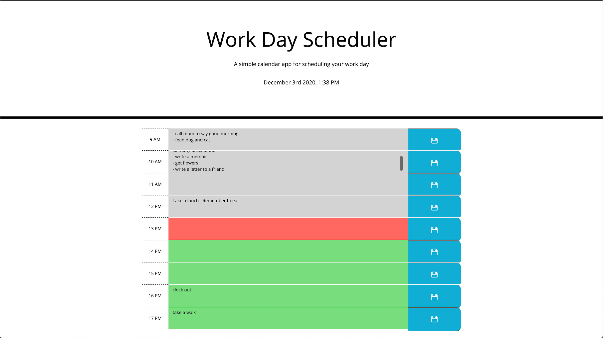
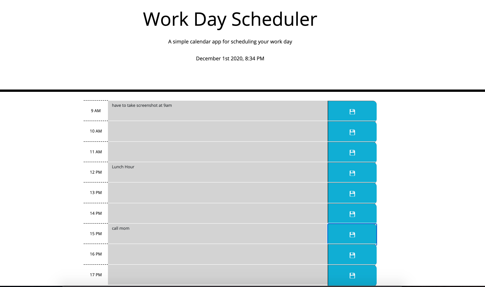

# Workday Schedule Application

Workday Scheduler/Planner Application

The purpose of the application is to allow users to add important events to the planner to allow them to effectively manage their workday

## Description

    This is a simple day planner application that allows a user to save events for each hour of the day. It runs in the browser and features dynamically updated HTML and CSS powered by jQuery.

    When a user open the planner, the current date and time are both displayed at the top of the page. The user is presented with time blcoks for the business hours 9-5pm. The time blocks are color coded. The colors indicate whether the time block is in the past, present, or future. 

    Clicking on the individual time block allows the user to type their notes. Once they add text, they can click the save button which saves the notes into local storage. This will ensure that when a page is refreshed the users notes persist. 

    Requirements:
   * Uses the Moment.js library to display date and time
   * Timeblocks are rendered via jQuery for the different hours of the business day
   * Timeblocks are color-coded to indicate if hour is in past, present, or future
   * User can insert notes to the different time blocks
   * Notes saved by user are saved to local storage
   * If page is refreshed, the notes are rendered from the local storage

### Screenshots of Application:

Screenshot video of app functionality can be found in the Assets folder

## Table of Contents (Optional)

* [Installation](#installation)
* [Usage](#usage)
* [Credits](#credits)
* [License](#license)
* [Contributing](#Contributing)
* [Tests](#Tests)

## Installation

    Feel free to clone this repository and use it as your daily planner or use it to practive your code

## Usage

    This code is free for anyone to copy or clone and use.
    You can use it anytime you need a daily scheduler.

## Credits

    n/a

## License

    This is free and unencumbered software released into the public domain.

    Anyone is free to copy, modify, publish, use, compile, sell, or
    distribute this software, either in source code form or as a compiled
    binary, for any purpose, commercial or non-commercial, and by any
    means.

    In jurisdictions that recognize copyright laws, the author or authors
    of this software dedicate any and all copyright interest in the
    software to the public domain. We make this dedication for the benefit
    of the public at large and to the detriment of our heirs and
    successors. We intend this dedication to be an overt act of
    relinquishment in perpetuity of all present and future rights to this
    software under copyright law.

    THE SOFTWARE IS PROVIDED "AS IS", WITHOUT WARRANTY OF ANY KIND,
    EXPRESS OR IMPLIED, INCLUDING BUT NOT LIMITED TO THE WARRANTIES OF
    MERCHANTABILITY, FITNESS FOR A PARTICULAR PURPOSE AND NONINFRINGEMENT.
    IN NO EVENT SHALL THE AUTHORS BE LIABLE FOR ANY CLAIM, DAMAGES OR
    OTHER LIABILITY, WHETHER IN AN ACTION OF CONTRACT, TORT OR OTHERWISE,
    ARISING FROM, OUT OF OR IN CONNECTION WITH THE SOFTWARE OR THE USE OR
    OTHER DEALINGS IN THE SOFTWARE.

    For more information, please refer to <https://unlicense.org>

## Badges

    n/a

## Contributing

    # Contributor Covenant Code of Conduct

    ## Our Pledge

    We as members, contributors, and leaders pledge to make participation in our
    community a harassment-free experience for everyone, regardless of age, body
    size, visible or invisible disability, ethnicity, sex characteristics, gender
    identity and expression, level of experience, education, socio-economic status,
    nationality, personal appearance, race, religion, or sexual identity
    and orientation.

    We pledge to act and interact in ways that contribute to an open, welcoming,
    diverse, inclusive, and healthy community.

    ## Our Standards

    Examples of behavior that contributes to a positive environment for our
    community include:

    * Demonstrating empathy and kindness toward other people
    * Being respectful of differing opinions, viewpoints, and experiences
    * Giving and gracefully accepting constructive feedback
    * Accepting responsibility and apologizing to those affected by our mistakes,
    and learning from the experience
    * Focusing on what is best not just for us as individuals, but for the
    overall community

    Examples of unacceptable behavior include:

    * The use of sexualized language or imagery, and sexual attention or
    advances of any kind
    * Trolling, insulting or derogatory comments, and personal or political attacks
    * Public or private harassment
    * Publishing others' private information, such as a physical or email
    address, without their explicit permission
    * Other conduct which could reasonably be considered inappropriate in a
    professional setting

    ## Enforcement Responsibilities

    Community leaders are responsible for clarifying and enforcing our standards of
    acceptable behavior and will take appropriate and fair corrective action in
    response to any behavior that they deem inappropriate, threatening, offensive,
    or harmful.

    Community leaders have the right and responsibility to remove, edit, or reject
    comments, commits, code, wiki edits, issues, and other contributions that are
    not aligned to this Code of Conduct, and will communicate reasons for moderation
    decisions when appropriate.

    ## Scope

    This Code of Conduct applies within all community spaces, and also applies when
    an individual is officially representing the community in public spaces.
    Examples of representing our community include using an official e-mail address,
    posting via an official social media account, or acting as an appointed
    representative at an online or offline event.

    ## Enforcement

    Instances of abusive, harassing, or otherwise unacceptable behavior may be
    reported to the community leaders responsible for enforcement at
    [INSERT CONTACT METHOD].
    All complaints will be reviewed and investigated promptly and fairly.

    All community leaders are obligated to respect the privacy and security of the
    reporter of any incident.

    ## Enforcement Guidelines

    Community leaders will follow these Community Impact Guidelines in determining
    the consequences for any action they deem in violation of this Code of Conduct:

    ### 1. Correction

    **Community Impact**: Use of inappropriate language or other behavior deemed
    unprofessional or unwelcome in the community.

    **Consequence**: A private, written warning from community leaders, providing
    clarity around the nature of the violation and an explanation of why the
    behavior was inappropriate. A public apology may be requested.

    ### 2. Warning

    **Community Impact**: A violation through a single incident or series
    of actions.

    **Consequence**: A warning with consequences for continued behavior. No
    interaction with the people involved, including unsolicited interaction with
    those enforcing the Code of Conduct, for a specified period of time. This
    includes avoiding interactions in community spaces as well as external channels
    like social media. Violating these terms may lead to a temporary or
    permanent ban.

    ### 3. Temporary Ban

    **Community Impact**: A serious violation of community standards, including
    sustained inappropriate behavior.

    **Consequence**: A temporary ban from any sort of interaction or public
    communication with the community for a specified period of time. No public or
    private interaction with the people involved, including unsolicited interaction
    with those enforcing the Code of Conduct, is allowed during this period.
    Violating these terms may lead to a permanent ban.

    ### 4. Permanent Ban

    **Community Impact**: Demonstrating a pattern of violation of community
    standards, including sustained inappropriate behavior,  harassment of an
    individual, or aggression toward or disparagement of classes of individuals.

    **Consequence**: A permanent ban from any sort of public interaction within
    the community.

    ## Attribution

    This Code of Conduct is adapted from the [Contributor Covenant][homepage],
    version 2.0, available at
    https://www.contributor-covenant.org/version/2/0/code_of_conduct.html.

    Community Impact Guidelines were inspired by [Mozilla's code of conduct
    enforcement ladder](https://github.com/mozilla/diversity).

    [homepage]: https://www.contributor-covenant.org

    For answers to common questions about this code of conduct, see the FAQ at
    https://www.contributor-covenant.org/faq. Translations are available at
    https://www.contributor-covenant.org/translations.

## Tests

    Test that the application saves the notes based appropriately into the local storage and persists upon page refresh

    And remember when making your edits to push your edits often and test.
